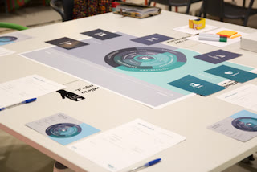
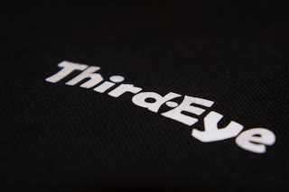
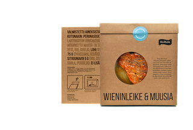

<!--
=================
Hero Area
================= 
-->
<section class="hero-area header-area">
    

        

            

               

                    <h4>My Works</h4>
                    <h1>SHOWCASE.</h1>
                    
                    
Lorem ipsum dolor sit amet, consectetur adipisicing elit. Illum reiciendis quasi itaque, obcaecati atque sit!

                

            

        

    

</section> 
<!--
Start About Section
==================================== -->
<section class="about-2 section bg-gray" id="about">
    

        

            

                <h2>Wärtsilä</h2>
            

            

                
Lorem ipsum dolor sit amet, consectetur adipisicing elit. Quae deleniti ipsa labore necessitatibus culpa veritatis quo accusantium, neque enim ea ad eaque iure, quas tempore velit, quibusdam dolor illo! Explicabo.

                
Lorem ipsum dolor sit amet, consectetur adipisicing elit. Aliquid quisquam maiores iste soluta, nihil dolorem?

            

        
         
        <!-- End row -->
    
     
    <!-- End container -->
</section> 
<!-- End section -->

<!-- Start Portfolio Section
=========================================== -->
<section class="portfolio section" id="portfolio">
    

        

            

                

                    <h4>RECENT WORK</h4>
                    <h2>WORK SHOWCASE.</h2>
                    
                    
Lorem ipsum dolor sit amet, consectetur adipisicing elit. Illum reiciendis quasi itaque, obcaecati atque sit!

                

            

        

        

            

                <!-- /section title -->
                

                    <button type="button" data-filter="all">All</button>
                    <button type="button" data-filter=".product">Product </button>
                    <button type="button" data-filter=".service">Service</button>
                    <button type="button" data-filter=".strategy">Strategy</button>
                    <button type="button" data-filter=".tools">Tools</button>
                

            

        
         
        <!-- /end col-lg-12 -->
        

            

                 <a class="search-icon" href="">

                    
                    

                         <i class="tf-ion-ios-search-strong"></i> 
                        <h4><a href="">Wärtsilä</a></h4>
                    

                
</a>
            

            

                

                    
                    

                        <h4><a href="">Packaging Value Cycle </a></h4>
                        <a class="search-icon" href=""> <i class="tf-ion-ios-search-strong"></i> </a>
                    

                

            

            

                

                    
                    

                        <a class="search-icon" href="images/portfolio/ThirdEye.jpg" data-lightbox="image-1"> <i class="tf-ion-ios-search-strong"></i> </a>
                        <h4><a href="">ThirdEye</a></h4>
                    

                

            

            

                

                    
                    

                        <a class="search-icon" href="images/portfolio/icarusnova.jpg" data-lightbox="image-1"> <i class="tf-ion-ios-search-strong"></i> </a>
                        <h4><a href="">Icarus nova</a></h4>
                    

                

            

            

                

                    
                    

                        <a class="search-icon" href="images/portfolio/HoviRuoka.png" data-lightbox="image-1"> <i class="tf-ion-ios-search-strong"></i> </a>
                        <h4><a href="">HoviRuoka</a></h4>
                    

                

            

            

                

                    
                    

                        <a class="search-icon" href="images/portfolio/portfolio-1.jpg" data-lightbox="image-1"> <i class="tf-ion-ios-search-strong"></i> </a>
                        <h4><a href="">Photography Website</a></h4>
                    

                

            

        

    
     
    <!-- end row -->
</section> 
<!-- End section -->

<!-- Srart Contact Us
		=========================================== --> 
<section class="contact-us section bg-gray" id="contact">
    

        

            

                

                    <h4>Drop us a note</h4>
                    <h2>Contact Us.</h2>
                    
                    
Lorem ipsum dolor sit amet, consectetur adipisicing elit. Illum reiciendis quasi itaque, obcaecati atque sit!

                

            

        

        

            <!-- Contact Details -->
            

                

                    

                

            

            <!-- / End Contact Details -->
            <!-- Contact Form -->
            

                <form id="contact-form" method="post" action="sendmail.php" role="form">
                    

                        <input type="text" placeholder="Your Name" class="form-control" name="name" id="name">
                    

                    

                        <input type="email" placeholder="Your Email" class="form-control" name="email" id="email">
                    

                    

                        <input type="text" placeholder="Subject" class="form-control" name="subject" id="subject">
                    

                    

                        <textarea rows="6" placeholder="Message" class="form-control" name="message" id="message"></textarea>                         
                    

                    

                        Thank you. The Mailman is on His Way :)

                    

                        Sorry, don't know what happened. Try later :(

                    

                        <input type="submit" id="contact-submit" class="btn btn-transparent" value="Submit">
                    
                     
                </form>
            

            <!-- ./End Contact Form -->
        
         
        <!-- end row -->
